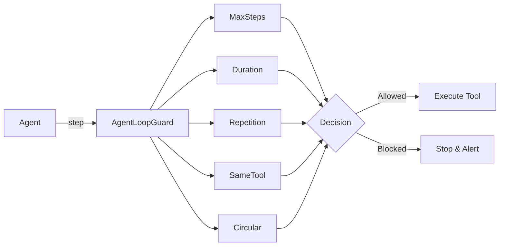

# 🛡️ agent-loop-guard-js

**Stop runaway AI agents before they burn your tokens, time, and money.**

`agent-loop-guard-js` is a high-performance, provider-independent safety utility for AI agents. It detects and blocks runaway execution—such as infinite loops, repeated tool calls, and circular patterns—before they happen.

[](https://www.npmjs.com/package/agent-loop-guard-js)
[](./LICENSE)
[](https://github.com/OMD-123/agent-loop-guard/actions/workflows/ci.yml)

---

## 🚀 Why do you need this?

AI agents are essentially loops: `LLM → tool → LLM → tool`. When these loops fail, they fail expensively:

- **The Hammer**: Calling the same tool with the same arguments 100 times.
- **The Error Loop**: Hammering a tool that consistently returns an error.
- **The Orbit**: Falling into circular patterns (`Tool A` $\rightarrow$ `Tool B` $\rightarrow$ `Tool A`).
- **The Runaway**: Simply never stopping, draining your API credits.

`agent-loop-guard-js` sits between your agent and its tools, returning a structured `allowed: boolean` decision. **Zero provider dependencies. Zero runtime dependencies. Total control.**

---

## 📦 Installation

```bash
npm install agent-loop-guard-js
# or
pnpm add agent-loop-guard-js
# or
yarn add agent-loop-guard-js
```

---

## ⚡ Quick Start

```ts
import { AgentLoopGuard } from "agent-loop-guard-js";

const guard = new AgentLoopGuard({
  maxSteps: 20,           // Stop after 20 total steps
  maxDuration: 60_000,    // Stop after 60 seconds
  maxRepeatedCalls: 3,    // Stop if same tool + args called 3x
  maxSameToolCalls: 5,    // Stop if any tool is called 5x in a row
});

function beforeEachStep(step) {
  const decision = guard.check(step);
  if (!decision.allowed) {
    throw new Error(`Agent Guard Blocked: ${decision.reason}`);
  }
  // Execute the approved step...
}
```

---

## ✨ Features

| Protection | Config Key | Detects |
| :--- | :--- | :--- |
| **Step Budget** | `maxSteps` | Total steps exceeded in a single run. |
| **Time Budget** | `maxDuration` | Run exceeds wall-clock limit (monotonic). |
| **Repetition** | `maxRepeatedCalls` | Identical tool + arguments called repeatedly. |
| **Tool Hammering**| `maxSameToolCalls` | Single tool called consecutively regardless of args. |
| **Circular Loops** | `loopPatternWindow` | Repeating sequences (e.g., `A → B → A → B`). |

### Technical Highlights:
- **Deterministic Canonicalization**: Arguments are normalized so `{a:1,b:2}` equals `{b:2,a:1}`.
- **Zero-Dependency**: No bloat. Works in Node.js, Bun, and Deno.
- **O(1) Memory Growth**: History is bounded; it will never crash your process on long runs.
- **Strongly Typed**: Full TypeScript support for a seamless DX.

---

## 🛠️ API Reference

### `new AgentLoopGuard(options?)`
Constructs a guard. All options are optional (0 = unlimited).

```ts
interface AgentLoopGuardOptions {
  maxSteps?: number;
  maxDuration?: number;
  maxRepeatedCalls?: number;
  maxSameToolCalls?: number;
  loopPatternWindow?: number;
  detectDuplicateArguments?: boolean;
  onViolation?: (event: ViolationEvent) => void;
}
```

### Core Lifecycle
- `guard.start()`: Records the start time of a run.
- `guard.check(step)`: Validates the next step. Returns a `GuardDecision`.
- `guard.end()`: Closes the current run.
- `guard.reset()`: Clears all history for a fresh start.

### The `GuardDecision`
`check()` returns a decision object:
- `allowed: true` $\rightarrow$ Proceed with execution.
- `allowed: false` $\rightarrow$ Stop the agent. Includes a `reason` (e.g., `LOOP_PATTERN_DETECTED`).

---

## 📐 Architecture



---

## 🤝 Contributing & Support

Contributions are welcome! Please ensure the pipeline is green:
`npm run typecheck && npm run lint && npm test`

If this tool saves you tokens and time, consider supporting its development:
👉 **[Sponsor on GitHub](https://github.com/sponsors/OMD-123)**

## 📄 License
MIT © [OMD-123](https://github.com/OMD-123)
