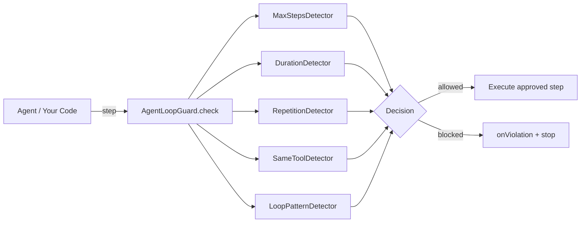

# agent-loop-guard

**Protect AI agents from runaway loops, repeated tool calls, and uncontrolled execution.**

`agent-loop-guard` is a provider-independent safety and reliability utility for AI agents. It detects and stops runaway agent execution before an agent gets stuck calling the same tools forever, cycling between tools, exceeding a step budget, or running for too long.

It works with **any** JavaScript/TypeScript agent implementation — OpenAI, Anthropic, LangChain, Vercel AI SDK, or your own hand-rolled loop. The core has **zero provider dependencies**, **zero runtime dependencies**, and only observes steps; it never executes your tools.

[](https://github.com/agent-loop-guard/agent-loop-guard/actions/workflows/ci.yml)
[](https://www.npmjs.com/package/agent-loop-guard)
[](./LICENSE)

---

## Why?

An LLM-driven agent is just a loop:

```
LLM → tool → LLM → tool → LLM → ...
```

Sometimes that loop goes wrong:

- It calls the **same tool with the same arguments** a hundred times.
- It **hammer a single tool** that keeps returning an error.
- It falls into a **circular pattern** (`toolA → toolB → toolA → toolB …`).
- It simply never stops, burning tokens, time, and money.

`agent-loop-guard` sits *in front of* each step and returns a structured decision.
You stop the run when it says `allowed: false`. No magic, no framework lock-in —
just a few lines around your existing loop.

---

## Installation

```bash
npm install agent-loop-guard
```

```bash
pnpm add agent-loop-guard
```

```bash
yarn add agent-loop-guard
```

---

## Quick Start

```ts
import { AgentLoopGuard } from "agent-loop-guard";

const guard = new AgentLoopGuard({
  maxSteps: 20,
  maxDuration: 60_000,
  maxRepeatedCalls: 3,
  maxSameToolCalls: 5,
});

function beforeEachStep(step) {
  const decision = guard.check(step);
  if (!decision.allowed) {
    throw new Error(decision.reason);
  }
  // Agent executes the approved step.
}
```

---

## Features

| Protection            | Config key              | Detects                                                        |
| --------------------- | ----------------------- | -------------------------------------------------------------- |
| Maximum steps         | `maxSteps`              | Too many steps in a single run.                                |
| Maximum duration      | `maxDuration`           | Run exceeds a wall-clock/time budget (monotonic clock).         |
| Repeated calls        | `maxRepeatedCalls`      | Same tool + same arguments called over and over.               |
| Same tool             | `maxSameToolCalls`      | One tool hammered in a row, regardless of arguments.           |
| Circular patterns     | `loopPatternWindow`     | Repeating sequences like `A → B → A → B` or `A → B → C → A …`. |

Plus:

- **Deterministic argument canonicalization** — `{a:1,b:2}` equals `{b:2,a:1}`;
  safe to use on untrusted input (no `eval`, never crashes on circular refs).
- **Strongly typed** event model — add new step types without breaking changes.
- **Lifecycle methods** — `start()`, `check()`, `end()`, and `reset()`.
- **Runtime statistics** — `stats()`.
- **Violation hooks** — `onViolation` callback.
- **Structured errors** — `AgentLoopGuardError`.
- **Zero runtime dependencies**, ESM-only, Tree-shakeable.

---

## API

### `new AgentLoopGuard(options?)`

Construct a guard. All limits are optional; omitting one disables that
protection (unlimited budget). Configuration is validated at construction time —
invalid config throws a clear error (e.g. negative `maxSteps`).

```ts
interface AgentLoopGuardOptions {
  /** Max number of steps (llm + tool + custom) per run. 0 = unlimited. */
  maxSteps?: number;
  /** Max run duration in ms (monotonic). 0 = unlimited. */
  maxDuration?: number;
  /** Max consecutive identical (name + args) calls. 0 = disabled. */
  maxRepeatedCalls?: number;
  /** Max consecutive same-tool calls. 0 = disabled. */
  maxSameToolCalls?: number;
  /** Window length for circular-pattern detection. 0 = disabled (min 2). */
  loopPatternWindow?: number;
  /** Compare arguments for repeated-call detection. Default: true. */
  detectDuplicateArguments?: boolean;
  /** Fired once per blocking decision. */
  onViolation?: (event: ViolationEvent) => void;
}
```

### `guard.start(timestamp?)` / `guard.check(step)` / `guard.end()`

Explicit lifecycle. `start()` records the run's start time; `check()` validates
the next step; `end()` closes the run.

### `guard.check(step)` — lazy mode

`check()` **lazily starts** a run on the first call, so `start()` is optional
for simple integrations. After `reset()` or `end()`, the next `check()` begins a
fresh run. A step may carry its own `timestamp` (ms) to drive the duration clock
on the same timeline as your agent.

```ts
const decision = guard.check({
  type: "tool",
  name: "web_search",
  arguments: { query: "Node.js" },
  timestamp: Date.now(),
});
```

`check()` **never throws**. It returns a `GuardDecision`:

```ts
type GuardDecision =
  | { allowed: true; stepCount: number }
  | {
      allowed: false;
      reason: GuardReason;   // one of the reasons below
      stepCount: number;
      details?: Record<string, unknown>;
    };

type GuardReason =
  | "MAX_STEPS_EXCEEDED"
  | "MAX_DURATION_EXCEEDED"
  | "REPEATED_CALL_LIMIT_EXCEEDED"
  | "SAME_TOOL_LIMIT_EXCEEDED"
  | "LOOP_PATTERN_DETECTED";
```

A blocked step is **not** committed to the run's history, so a violation never
poisons a subsequent run after `reset()`.

### `guard.reset()`

Clears all state (step count, history, timers, detector counters) so the same
instance can guard an independent run.

### `guard.stats()`

```ts
{
  stepCount: 12,
  toolCalls: 8,
  llmCalls: 4,
  duration: 4210,      // ms, monotonic
  uniqueTools: 3,
  repeatedCalls: 2
}
```

Read-only — each call returns a fresh snapshot.

### `onViolation` event

```ts
const guard = new AgentLoopGuard({
  onViolation: (event) => {
    // { reason, stepCount, timestamp, details? }
    console.warn(`Guard blocked run: ${event.reason}`);
  },
});
```

The callback runs once per blocking decision and can never break the guard
(exceptions are swallowed).

### `AgentLoopGuardError`

```ts
import { AgentLoopGuardError } from "agent-loop-guard";

try {
  const decision = guard.check(step);
  if (!decision.allowed) throw new AgentLoopGuardError(decision);
} catch (err) {
  if (err instanceof AgentLoopGuardError) {
    err.reason;     // GuardReason
    err.stepCount;  // number
    err.decision;   // the full GuardDecision
  }
}
```

---

## Configuration

All limits default to `0` (disabled), so a guard with no options never blocks —
wire in only the protections you want.

```ts
// Only guard against runaway repetition; leave steps/duration unlimited.
const guard = new AgentLoopGuard({
  maxRepeatedCalls: 3,
  maxSameToolCalls: 5,
  loopPatternWindow: 6,
});
```

Invalid configuration is rejected at construction:

| Invalid input                       | Result                                  |
| ----------------------------------- | --------------------------------------- |
| `maxSteps: -1`                      | throws                                   |
| `maxDuration: -5`                   | throws                                   |
| `maxSteps: 2.5` (non-integer)      | throws                                   |
| `loopPatternWindow: 1` (min is 2)   | throws                                   |
| `onViolation: "nope"` (non-fn)      | throws                                   |

---

## Examples

### Basic agent

```ts
const guard = new AgentLoopGuard({
  maxSteps: 20,
  maxRepeatedCalls: 3,
  maxSameToolCalls: 5,
});

for await (const step of agent.run()) {
  const decision = guard.check(step);
  if (!decision.allowed) {
    console.error("Agent stopped:", decision.reason);
    break;
  }
  // Application executes the approved step here.
}
```

### Tool loop / repeated calls

```ts
const guard = new AgentLoopGuard({
  maxRepeatedCalls: 3,
  onViolation: (e) => console.warn("Violation:", e.reason),
});

for (const q of queries) {
  const decision = guard.check({
    type: "tool",
    name: "search",
    arguments: { query: q },
  });
  if (!decision.allowed) {
    console.error("Loop detected:", decision.reason);
    break;
  }
}
```

### Budget / step protection

```ts
const guard = new AgentLoopGuard({ maxSteps: 20, maxDuration: 30_000 });
guard.start();

while (agent.shouldContinue()) {
  const step = agent.nextStep();
  const decision = guard.check(step);
  if (!decision.allowed) {
    console.log("Budget exceeded:", decision.reason, guard.stats());
    break;
  }
}
guard.end();
```

Runnable examples live in [`examples/`](./examples): `basic.ts`, `tool-loop.ts`,
and `agent.ts` (a generic async agent stub).

---

## Framework Independence

`agent-loop-guard` is **observer-only**. It receives a description of each step
and tells you whether to proceed. It never imports OpenAI, Anthropic, LangChain,
the Vercel AI SDK, or Google AI — and never executes your tools.

```
Agent ──▶ agent-loop-guard ──▶ ALLOW ──▶ Tool executes
                       └────▶ BLOCK ──▶ Agent stops
```

This is why it drops into any architecture: you wrap your existing step stream,
and your agent keeps full control over execution.

---

## Architecture



The guard is a composition of small, focused **detectors** (strategy pattern).
Each detector is stateless with respect to history — it reads shared `GuardState`
and keeps only a tiny, bounded counter of its own. Adding a new protection means
adding one detector file and wiring it into the array in `AgentLoopGuard`;
nothing else changes.

**Algorithmic notes**

- **Canonicalization** (`normalization/canonicalize.ts`) recursively normalizes
  arguments into a stable, type-prefixed string. Object keys are sorted so order
  is irrelevant; a `WeakSet` tracks seen objects so circular references collapse
  to a sentinel instead of throwing. O(depth × nodes) per call.
- **Loop detection** inspects only the trailing `loopPatternWindow` of history
  and tests each period `p ∈ [1 … ⌊W/2⌋`, returning the smallest period that
  explains the whole window. O(W²) work per step, bounded by the window.
- **History** is bounded to `max(loopPatternWindow, 2 × maxSameToolCalls)`, so
  memory stays flat even on very long runs — no unbounded growth.

---

## Contributing

Contributions welcome! To get started:

1. Fork and clone the repo.
2. Install dependencies: `npm install`.
3. Make your change with tests.
4. Ensure the pipeline is green: `npm run typecheck && npm run lint && npm test`.
5. Open a pull request.

Please add tests for any new detector or behavior, and keep the public API small
and provider-agnostic.

---

## Development

```bash
npm install      # install dev dependencies
npm test         # run the test suite (vitest)
npm run build    # compile to dist/ (declarations + source maps)
npm run typecheck
npm run lint
```

To try the examples (needs the package built first):

```bash
npx vite-node examples/agent.ts
```

---

## Roadmap

Planned future features (not in the MVP):

- [ ] Cost limit
- [ ] Token budget
- [ ] Persistent run history
- [ ] OpenTelemetry integration
- [ ] Framework adapters
- [ ] Streaming support improvements
- [ ] Advanced loop detection
- [ ] Agent trace visualization

---

## License

[MIT](./LICENSE) © agent-loop-guard contributors
